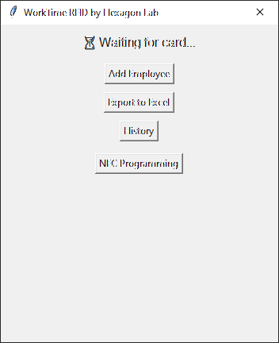
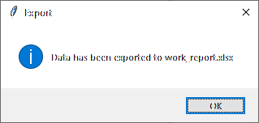
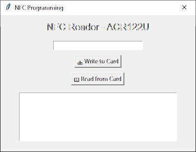

---

# 🕒 **WorkTime RFID**

*A smart solution for tracking employee working hours using RFID/NFC cards*


*Visualization*

---

## 📌 Description

**WorkTime RFID** is an easy and efficient tool for tracking employee check-ins and check-outs using RFID/NFC cards. Built with Python and `tkinter`, it offers a user-friendly graphical interface and multiple practical features.

---

## 🛠️ Key Features

* ✅ **Automatic RFID scanning**: Detects new cards and automatically logs IN/OUT events.
* ➕ **Add employees**: Register new employees by scanning a card and entering their name.
* 📄 **Export to Excel**: Generates a report of all events in `work_report.xlsx`.
* 📜 **Event history**: View all logs in a separate window.
* 🪪 **NFC card programming**: Interface for writing data to NFC tags.

---

## 📦 Requirements

* Python 3.7+
* External modules:

  * `tkinter` (built-in)
  * `openpyxl` or `xlsxwriter` (for Excel export)
  * `nfcpy` (for NFC programming)

---

## ▶️ Getting Started

1. Clone the repository:

   ```bash
   git clone https://github.com/KallPetrov/WorkTime-RFID.git
   cd worktime-rfid
   ```

2. Install dependencies:

   ```bash
   pip install -r requirements.txt
   ```

3. Launch the application:

   ```bash
   python main.py
   ```

---

## 🖼️ Screenshots

### Main Screen


*Waiting for RFID card interface.*

### Event History


*List of all recorded events.*

### NFC Programming


*Interface for programming NFC cards.*

---

## 📁 Project Structure

```
/worktime-rfid
│
├── main.py              # Main GUI and logic
├── db.py                # Database operations
├── rfid_reader.py       # RFID card reading
├── excel_export.py      # Export to Excel
├── nfc_programmer.py    # NFC tag programming interface
├── assets/
│   ├── logo.png         # Project logo
│   ├── screenshot1.png  # Screenshot 1
│   ├── screenshot2.png  # Screenshot 2
│   └── screenshot3.png  # Screenshot 3
└── README.md            # This file
```

---

## 🧪 Testing

1. Connect your RFID/NFC reader to the computer.
2. Run the application and test its features:

   * Scan RFID cards.
   * Add new employees.
   * View event history.
   * Export data to Excel.
   * Program NFC tags.

---

## 📌 Notes

* Make sure all required modules are installed.
* A compatible NFC reader is required for tag programming.
* The project is designed for small offices and workgroups.

---

Need help setting things up or have questions? Don’t hesitate to reach out to **Hexagon Lab**!

---

**License: MIT**

---

👤 Author
Hexagon Lab
📧 contact@hexagon-lab.com
🌐 hexagon-lab.com
🐙 GitHub Profile
